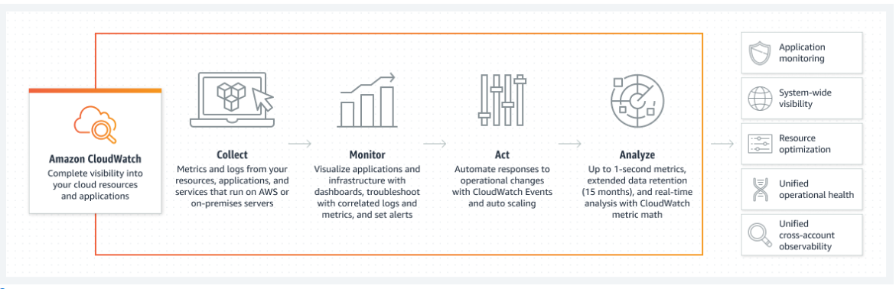
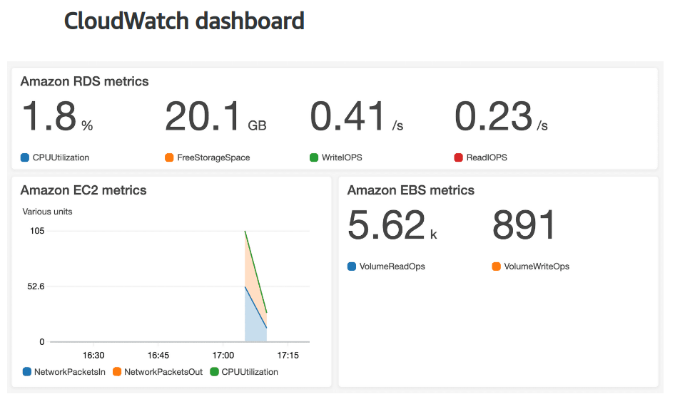

# AWS CloudWatch

- AWS CloudWatch is a web service that enables you to monitor and manage various metrics and configure alarm actions based on data from those metrics.
- CloudWatch relies on metrics for its working.Metrics are data about the performance of your systems that are provided free of cost by many services like EC2,EBS,RDS etc
- With CloudWatch, you can create alarms that automatically perform actions if the value of your metric has gone above or below a predefined threshold. 
- Actions can be like shutting down the instance send notification through SNS etc.
- Study the below diagram very carefully.

