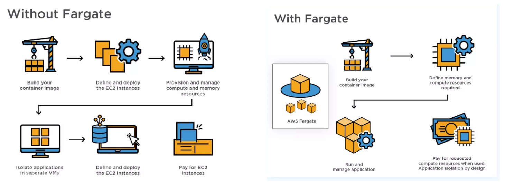

# AWS Fragate

- AWS Fragate is a Container as a Service(CaaS)
- If you need auto-scaling or run containers in a serverless environment, then Fargate is the right choice
- AWS Fargate is a technology that you can use with Amazon ECS to run containers without having to manage servers or clusters of Amazon EC2 instances. 
- With AWS Fargate, you no longer have to provision, configure, or scale clusters of virtual machines to run containers.
- It works with both Amazon ECS and Amazon EKS.
- When using AWS Fargate, you do not need to provision or manage servers. AWS Fargate manages your server infrastructure for you.
- Fargate prices are per second with no upfront charge.
- AWS Fargate will bill you based on the amount of vCPU, RAM, OS, CPU architecture, and storage that your containerized apps consume while running on EKS or ECS.

