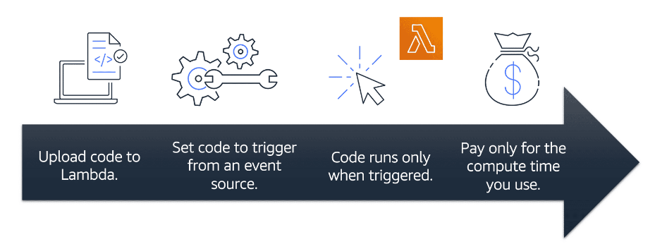

# AWS Lambda

- The term `serverless` means that your code runs on servers, but you do not need to provision or manage these servers.
- In serverless computing there is flexibility to scale serverless applications automatically
- AWS Lambda lets you run code without needing to provision or manage servers.
- While using AWS Lambda, you pay only for the compute time that you consume. Charges apply only when your code is running.
- For example, a simple Lambda function might involve automatically resizing uploaded images to the AWS Cloud. In this case, the function triggers when uploading a new image.

