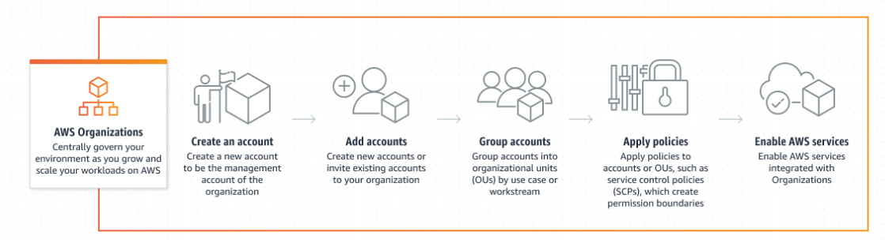

# AWS Organisations

- AWS organisations allows you to consolidate and manage multiple AWS accounts within a central location.
- In AWS Organizations, you can centrally control permissions for the accounts in your organization by using Service Control Policies(SCP).
- Service control policies (SCPs) are a type of organization policy that you can use to manage permissions in your organization. 
- SCPs offer central control over the maximum available permissions for all accounts in your organization.
- Allows you to restrict the individual API actions that users and roles in each member account can access.
- Consolidated billing is another feature of AWS Organizations.

---

# Organisational Unit

- In AWS Organizations, you can group accounts into organizational units (OUs) to make it easier to manage accounts with similar business or security requirements.
- When you apply a policy to an OU, all the accounts in the OU automatically inherit the permissions specified in the policy. -