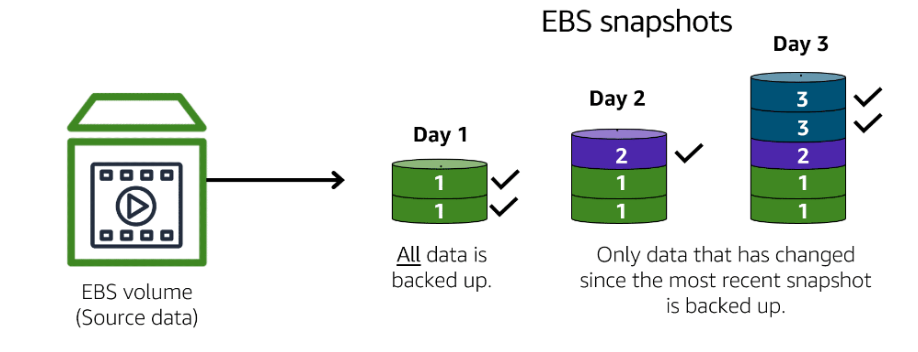
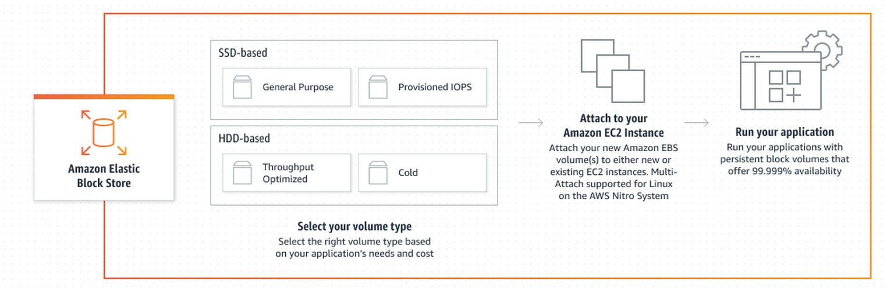

# Amazon Elastic Block Storage

- Amazon Elastic Block Store (Amazon EBS) is an easy-to-use, scalable, high-performance block-storage service designed for Amazon Elastic Compute Cloud.
- When you launch an ec-2 instance it might provide you instance storage volumes which is a temporary block-level storage for EC2 instance.
- This instance store is disk storage that is physically attached to the host computer for an EC2 instance, and therefore has the same lifespan as the instance so when the instance is terminated or stopped, you lose any data in the instance store.
- A solution to this is Amazon Elastic Block Storage because they are always persists.
- EBS allows you to take incremental backup of your data called snapshots.  Incremental Backup means that the first backup taken of a volume copies all the data. For subsequent backups, only the blocks of data that have changed since the most recent snapshot are saved. 
- EBS volume should be present in same availability zone as EC2 instance.
- EBS is volume stores data in a single availability zones.

