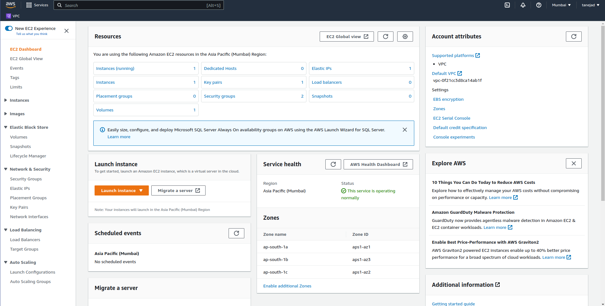

# Amazon Elastic Compute Cloud

- Amazon EC2 provides secure, resizable compute capacity in the cloud as Amazon EC2 instances.
- It runs on top of big physical host machine AWS machines using virtualization technologyThis phenomenan is called multitenancy and hypervysor is responsible for coordinating multitenancy.
- EC2 instances are highly scalableand we can also scale it horizontally using Amazon EC2 autoscaling groups.
- You don’t pay for stopped or terminated instances because there is no computation power used by them but EBS volumes attached to instances continue to retain information and accrue charges.

## Types of EC2 Instances

### General Purpose Instances

- General purpose instances provide a balance of compute, memory, and networking resources.
- If you need an application in which the resource needs for compute, memory, and networking are roughly equivalent and does not require optimization in any single resource area.

### Compute Optimized Instances

- Compute optimized instances are ideal for compute-bound applications that benefit from high-performance processors
- ideal for high-performance web servers, compute-intensive applications servers, and dedicated gaming server
- You can also use compute optimized instances for batch processing workloads that require processing many transactions in a single group.

### Memory Optimized instances

- Memory optimized instances are designed to deliver fast performance for workloads that process large datasets in memory.
- ideal for high-performance database or a workload that involves performing real-time processing of a large amount of unstructured data.

### Accelarated Computing Instances

- Accelerated computing instancesuse hardware accelerators, or coprocessors, to perform some functions more efficiently than is possible in software running on CPUs
- In computing, a hardware accelerator is a component that can expedite data processing.
- Accelerated computing instances are ideal for workloads such as graphics applications, game streaming, and application streaming.

### Storage Optimized Instance

- Storage optimized instances are designed for workloads that require high, sequential read and write access to large datasets on local storage.
- Storage optimized instances are designed to deliver tens of thousands of low-latency, random IOPS to applications.
- Input/Output operations per second (IOPS) is a metric that measures the performance of a storage device. It indicates how many different input or output operations a device can perform in one second.
- Ideal for distributed file systems, data warehousing applications, and high-frequency online transaction processing (OLTP) systems

## Scaling Amazon EC2 Instances

-> Scalability involves beginning with only the resources you need and designing your architecture to automatically respond to changing demand by scaling out or in.
-> There might be peek hours when application  is very high and unable to meet user requirements lowering Availability. Also there might be time when user activity is very low and resources remain idle and you still pay for them.
-> Amazon EC2 Auto Scaling enables you to automatically add or remove Amazon EC2 instances in response to changing application demand.
-> Within Amazon EC2 Auto Scaling, you can use two approaches `dynamic scaling` and `predictive scaling`.
-> Predictive Scaling automatically schedules the right number of Amazon EC2 instances based on predicted demand whereas Dynamic Scaling scales up and scale out according to changing demand.
-> To scale faster, you can use dynamic scaling and predictive scaling together.
-> When you create an Auto Scaling group, we get option to setup minimum capacity,desired capacity and maximim capacity.
-> Minimum Capacity is the number of Amazon EC2 instances that should always remain operational.
-> If you do not specify the desired capacity of Auto-Scaling group,the desired capacity defaults to your minimum capacity.
->  Maximum Capacity caps the maximum instances to which auto-scaling group can upscale to.