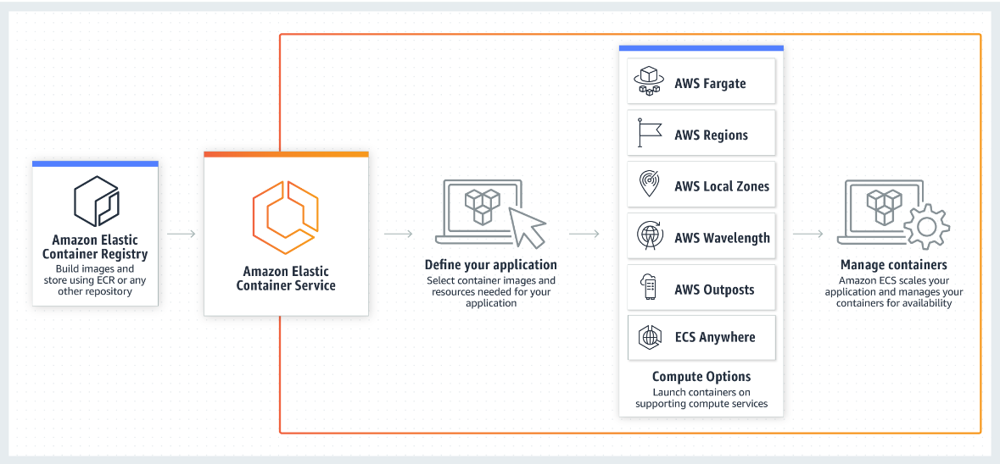

# Amazon-Elastic-Container-Service

- Amazon Elastic Container Service (Amazon ECS) is a container orchestration service that runs and manages Docker containers. 
- It runs clusters of virtual machines on the Amazon cloud, while managing, scaling, and scheduling groups of containers on those machines across multiple Availability Zones (AZs).
- With Amazon ECS, you can use API calls to launch and stop Docker-enabled applications.
- AWS supports the use of both open-source Docker Community Edition and subscription-based Docker Enterprise Edition.

