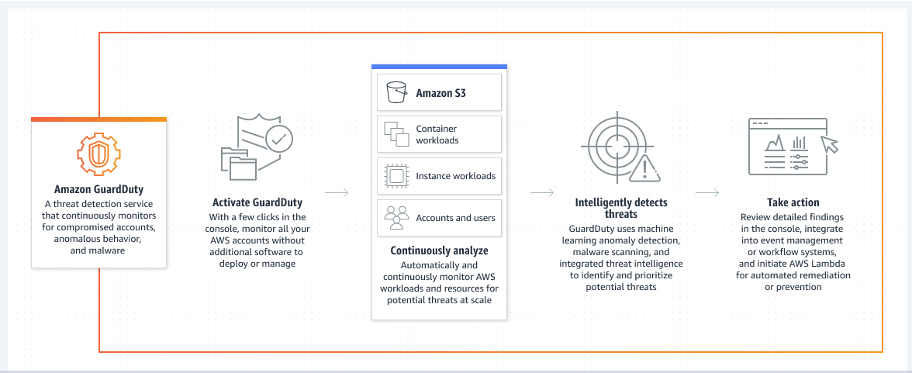

# Amazon Guard Duty

- Provides intelligent threat detection for your AWS infrastructure and resources.
- It identifies threats by continuously monitoring the network activity and account behavior within your AWS environment.
- If GuardDuty detects any threats, you can review detailed findings about them from the AWS Management Console. Findings include recommended steps for remediation
- You can also configure AWS Lambda functions to take remediation steps automatically in response to GuardDuty’s security findings.

