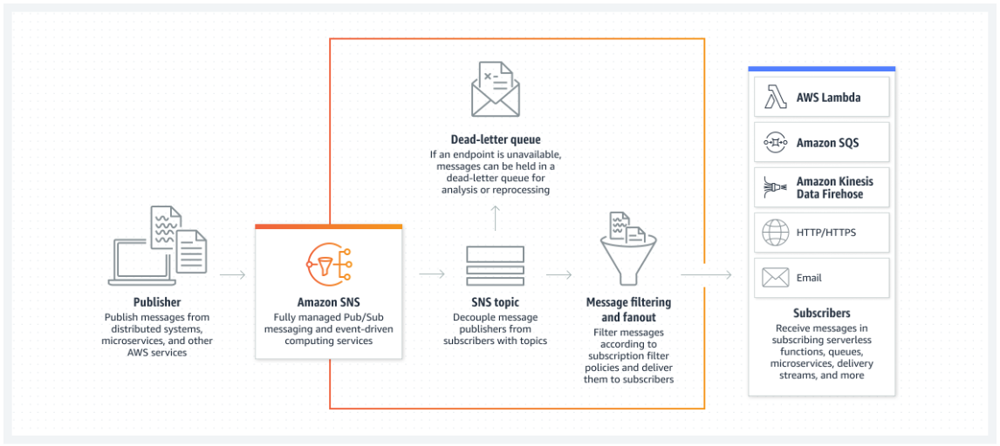
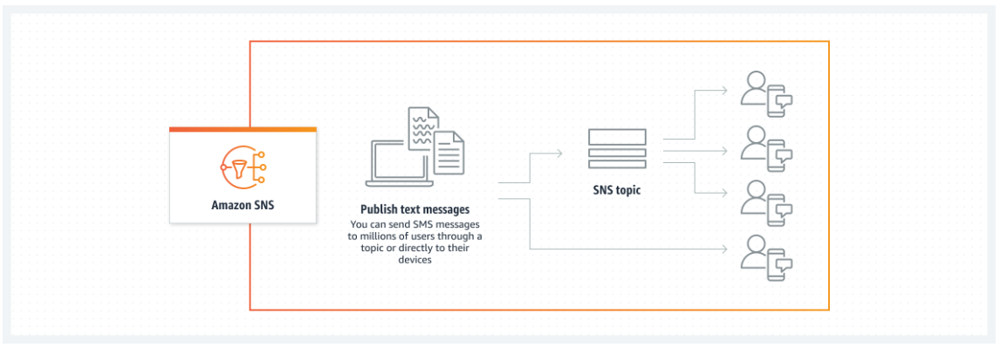
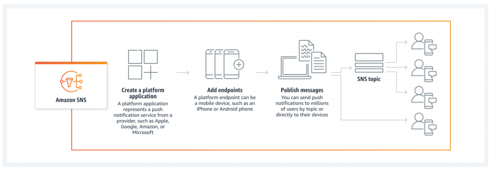

# Amazon Simple Notification Service

- Amazon Simple Notification Service (Amazon SNS) is a fully managed messaging service for both application-to-application (A2A) and application-to-person (A2P) communication.
- It is a Fully managed Pub/Sub service.
- In Amazon SNS, subscribers can be web servers, email addresses, AWS Lambda functions, or several other options

---

## Common Usecases of SNS

### Pub/Sub

### SMS

### Mobile Push

