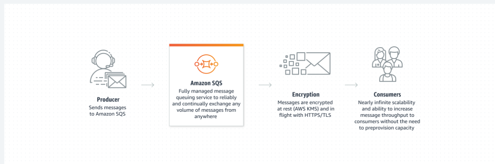

# Amazon Simple Queue Service

- Amazon SQS is a fully managed message queuing for microservices, distributed systems, and serverless applications
- Using Amazon SQS, you can send, store, and receive messages between software components, without losing messages or requiring other services to be available.
- In Amazon SQS, an application sends messages into a queue.
- A user or service retrieves a message from the queue, processes it, and then deletes it from the queue.

