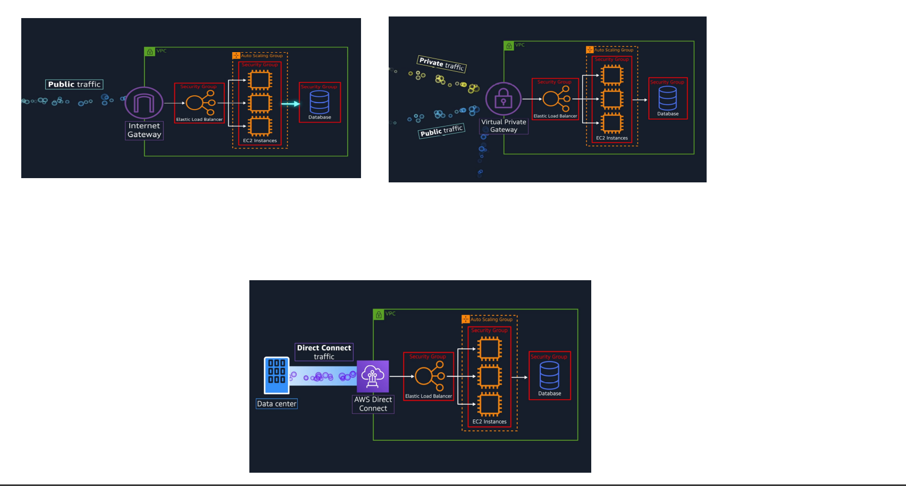
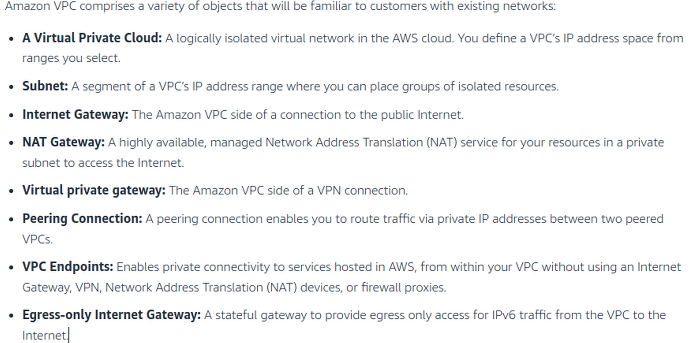

# Virtual Private Cloud(VPC)

- VPC is your own private network in aws.
- In AWS, you get a VPC by default.
- It allows you to define private IP range for your AWS resources.
- You often place these VPC’s in different subnets.
- Subnets are chunks of IP addresses in your VPC that allows you to group resources together.
- To allow inward/outward traffic to enter  VPC, you must attach an Internet Gateway(IGW) to it.
- To allow traffic from specific networks only, you must install a virtual private gateway.
- Virtual private Gateway allows us to create a VPN connection from your private network and VPC.
- However as the VPC is open to internet, the public traffic can cause traffic congestion and result in latency.The solution to this is AWS DirectConnect
- AWS Direct Connect allows you to establish a direct fiber connection between your data center and VPC.
- There are no additional charges for creating and using VPC aside for Data Transfer charges of service.

---

# Components of VPC

- 

---

## NAT

- NAT stands for network address translation.
- It's a way to map multiple local private addresses to a public one before transferring the information.
- Organizations that want multiple devices to employ a single IP address use NAT, as do most home routers.
- It is paid in AWS VPC

---

## Subnets in VPC

- Subnets monitor the traffic that comes if IGW into VPC.
- Every packet that passes through subnet is checked through Network Access Control List(Network ACL).
- We can set rules for both inbound and outboubount traffic of subnet.
- Network ACL allows all inbound and outbound traffic by default.
- Network ACLs perform stateless packet filtering ,meaning any change applied to an incoming rule isn’t automatically applied to an outgoing rule.
- If a request comes through port 80, it should be explicitly indicated that its outgoing response would be the same port 80.

- 