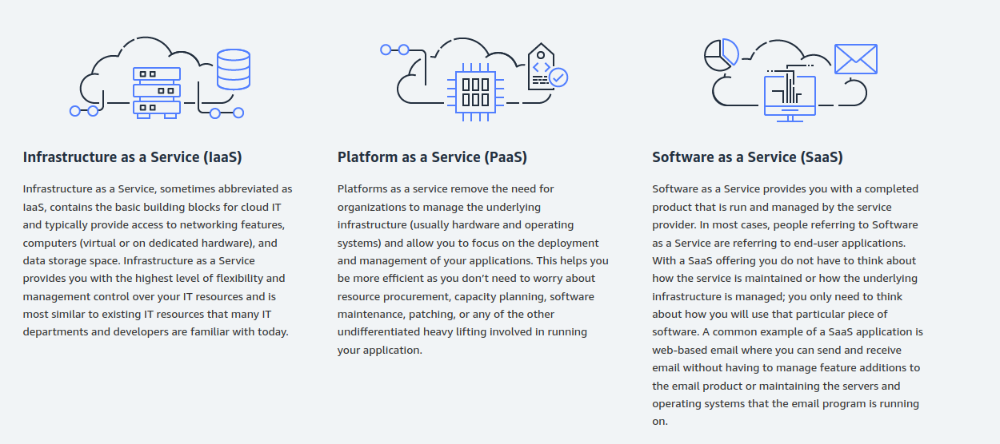
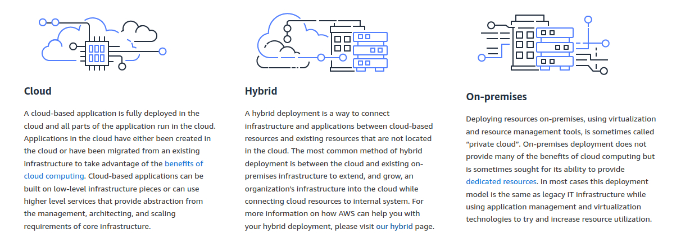
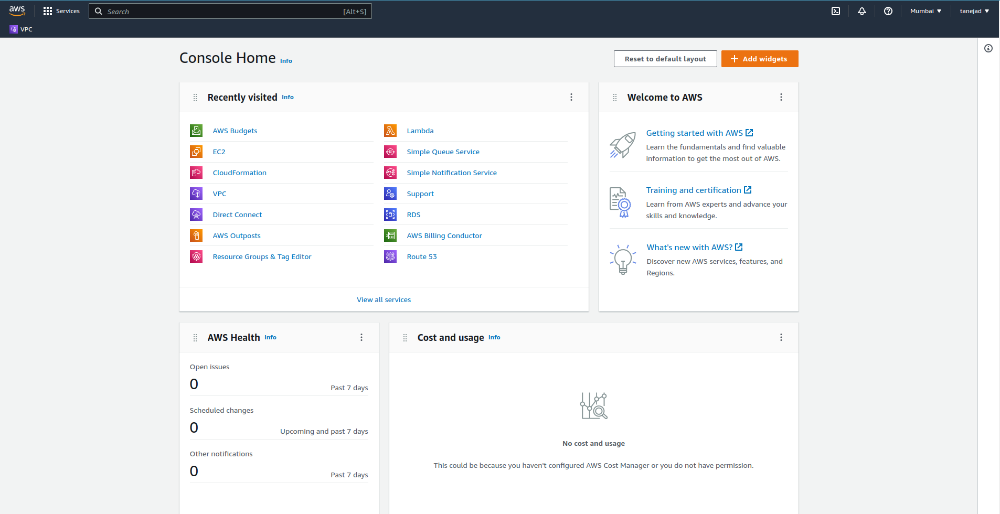

# Introduction to Cloud Computing

- On-demand delivery of IT resources and applications through the internet with pay-as-you-go pricing

## AWS Cloud Computing Models

## AWS Cloud Deploymnt Models

## Benifits of Cloud Computing

- Trade Upfrnt expense for variable expense.
- Stop spending money to run and maintain data centers.
- Stop guessing capacity.
- Increase speed and agility.
- Go global in minutes.

## AWS Console Glance

